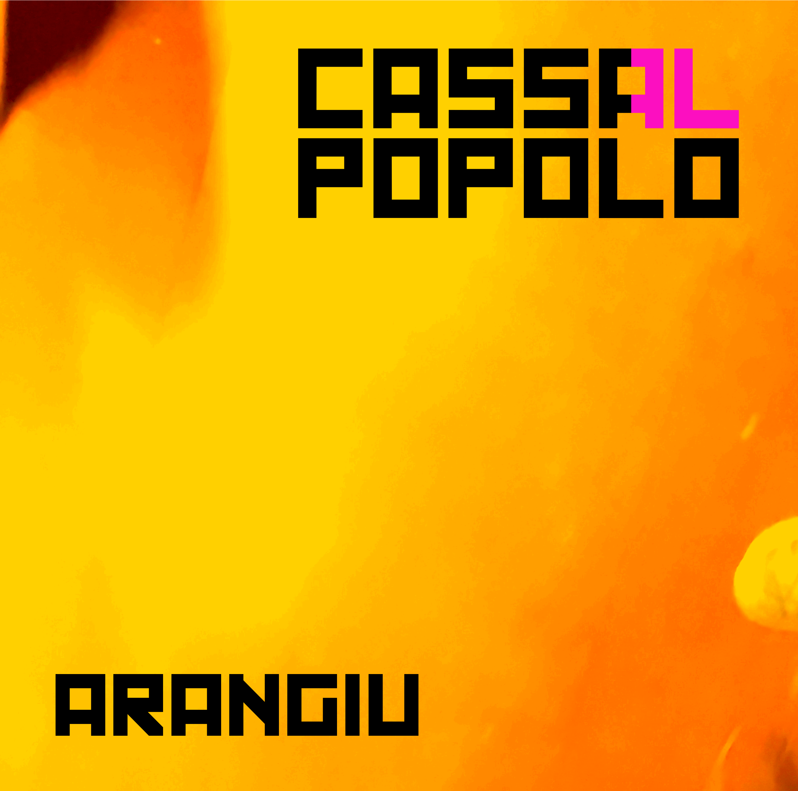

# CASSALPOPOLO

## Prelude

> Give us some 4/4 kick, we want to dance!
>
> *The peoples*

Since the early days of our species, humans have always created music, rhythms and chants.  
This is an interesting antropological tangent to go on, but for now let's focus on the fact that since the Computer Age,
humans did not really exploit the full potential that machines have to offer us.

But this has to stop. We'll take computers back to where they belong: as rhythm-generating devices.  
And AUTOMATED ones.

This is [Algorave]. Let's all dance together to the sound of bits and beats.

## Contents, AKA the beatz

This repo contains all the code responsible for generating all the beats over at [CASSALPOPOLO] (for pictures, check out [`@cassalpopolo` on Instagram][instagram])

### Releases:

**Arangiu** (2019) - [Music](), [Code](releases/arangiu)

[]()

## Setup

Music is made from three components:

1. [TidalCycles](https://tidalcycles.org/)
2. Korg Minilogue XD
3. Samples

#### Setting up Tidal

- Install Supercollider, SuperDirt and its samples following [Tidal's install](https://tidalcycles.org/index.php/Installation)
- [Install stack](https://docs.haskellstack.org/en/stable/install_and_upgrade/)
- [Setup `emacs` with this config](https://github.com/f-f/home/blob/8b40d0559216f2f85f6cb5c369ebdf13dc9555f9/.spacemacs#L473-L477)
- Clone this repo
- From this folder, start `emacs` to start the editor
- Start Supercollider, load `init.scd` to get channels configured and a proper amount of orbits
- Start Tidal from Emacs with `C-c C-s`
- Launch `./launchpad.py`

#### Setting up the samples

In this folder:
```
gsutil rsync -r gs://cassalpopolo samples
```

[Algorave]: https://algorave.com/
[CASSALPOPOLO]: https://soundcloud.com/cassalpopolo
[instagram]: https://www.instagram.com/cassalpopolo

